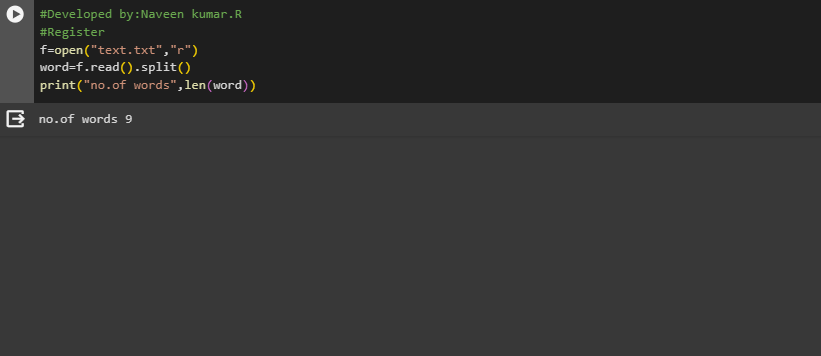

# Word-count
## AIM:
To write a python program for getting the word count from a text.
## EQUIPEMENT'S REQUIRED: 
PC
Anaconda - Python 3.7

# ALGORITHM:
# Step 1:
Decleare number of words is 0

# Step 2:
open it with txt file

# Step 3:
Give range for i

# Step 4:
Then nxt split the words

# Step 5:
count the number of words

# Step 6:
Giving print statement for getting output


## PROGRAM:
```
#Developed by:Naveen kumar.R
#Register No:23013536
f=open("text.txt","r")
word=f.read().split()
print("no.of words",len(word))
```

### OUTPUT:



## RESULT:
Thus the program is written to find the word count from a text.
